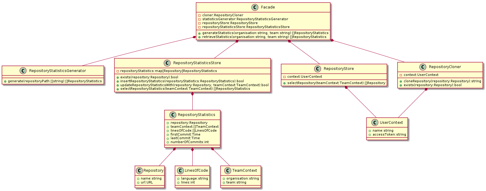
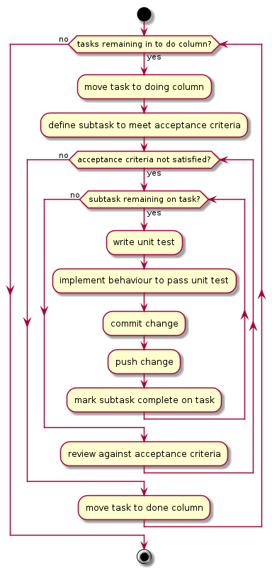

# Our Source

## Links

* [Task Board](https://trello.com/b/DuSRWbBH/)
  * uses the `Scaled` Power-Up
* [Decision Register](documentation/decisions)
* [Docker Image - Development with Vagrant](https://hub.docker.com/repository/docker/svanosselaer/our-source-development)

## Problem Statement

### Ideal

Ideally we have a wholistic understanding of our source code across our repositories so we can make sensible default decisions and be aware of deviations based on data not rhetoric.

### Reality

In reality we don't have a convenient way of aggregating repository statistics across our repositories and rely on rhetoric or manual analysis.

### Consequences

* analyse our repositories periodically to understand the technology landscape
* inability or lack of confidence when making sensible default decisions
* lack of visibility when there is drift from our sensible defaults

### Proposal

Write a service that will crawl, generate statistics for and aggregate the statistics of GitHub repositories.

## Build

How you can contribute to the project development and build locally on a `*nix` environment.

This project uses infrastructure as code mechanisms to provide a developer experience. The experience is delivered using [Vagrant](https://www.vagrantup.com), ([VirtualBox](https://www.virtualbox.org) and/or [Docker](https://www.docker.com)) and [Ansible](https://github.com/ansible/ansible).

To start a `Docker` container for developing on the project, run the following command from the terminal in the current directory:

```
vagrant up docker
```

To start and build a `VirtualBox` Virtual Machine for developing on the project, run the following command from the terminal in the current directory:

```
vagrant up virtualbox
```

To have both, run the following command from the terminal in the current directory:

```
vagrant up
```

You may decide to just use the `Ansible` configuration as a reference and configure your local machine to reflect the system requirements.

### Tested Configurations

| Requirement | Version |
|--|--|
| Operating System | macOS Catalina 10.15.7  |
| Vagrant | 2.2.14 |
| VirtualBox | 6.1.18 r142142 (Qt5.6.3) |
| Ansible | 2.10.6 |
| Docker | 20.10.5, build 55c4c88 |

### Building Development Docker Image

To build a new version of the development `Docker` image, run the following command from the terminal in the current directory:

```
vagrant up virtualbox
vagrant ssh
cd /vagrant
bin/build-development-image
```

**Note:** to run on another environment you will also need to install [Packer](https://www.packer.io).

## Test

How you can run the tests on a `*nix` environment to assert the solution behaviours are as expected.

If using the `Vagrant` setup run the following:

```
vagrant up docker
vagrant ssh
cd /vagrant
```

If on the `VirtualBox` or `Docker` setup you can use the following:

```
bin/test
```

**Note:** to run on another environment you will also need to install [Semgrep](https://semgrep.dev).

## Decisions

We are using [adr-tools](https://github.com/npryce/adr-tools) to capture project decisions.

[Decision Register](documentation/decisions)

## Design

### Class Diagram



## System Of Work

### 1. Know What We Are Doing


### 2. So We Can Implement


### 3. Plan


### 4. Implement


